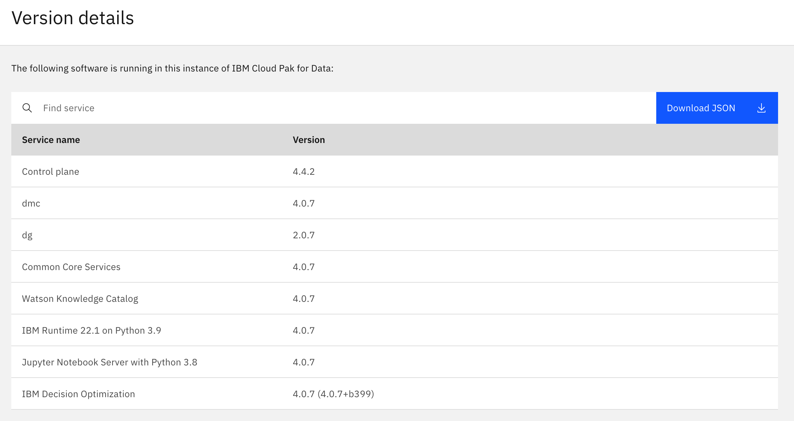

# How to get CP4D version

Here is a quick tip to get the CP4D versions in your browser.

Add `zen/#/versionDetails` at the end of the URL.

For instance
```
https://cpd-dfi.apps.ocp.nca.ihost.com/zen/#/versionDetails
```



Here is also the JSON file you can get.

```json
{
  "Control plane": {
    "version": "4.4.2"
  },
  "dmc": {
    "version": "4.0.7"
  },
  "dg": {
    "version": "2.0.7"
  },
  "Common Core Services": {
    "version": "4.0.7"
  },
  "Watson Knowledge Catalog": {
    "version": "4.0.7"
  },
  "IBM Runtime 22.1 on Python 3.9": {
    "version": "4.0.7"
  },
  "Jupyter Notebook Server with Python 3.8": {
    "version": "4.0.7"
  },
  "IBM Decision Optimization": {
    "version": "4.0.7 (4.0.7+b399)"
  }
}
```

The global CP4D version is mentionned in `Common Core Services`