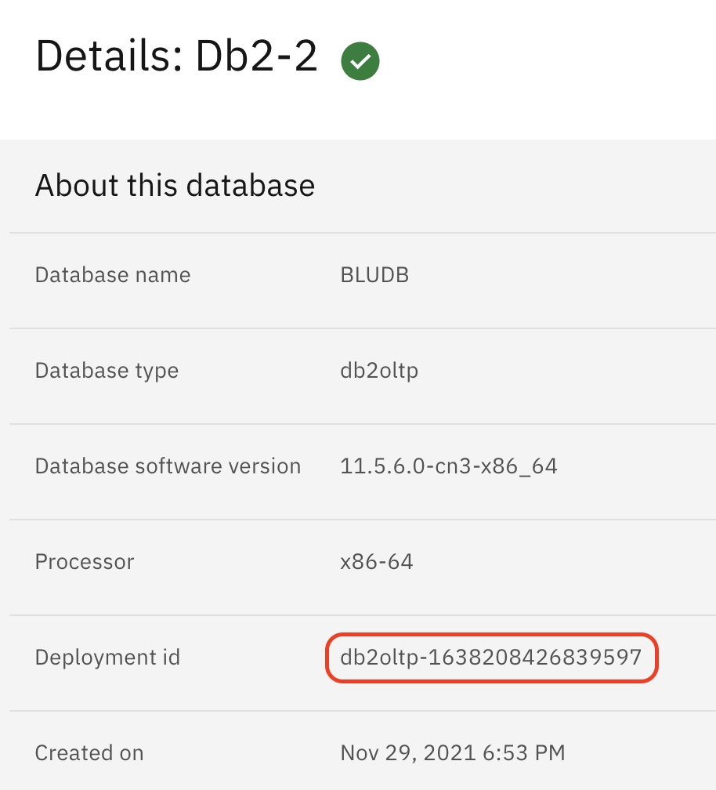

# View Db2 databases externally from a CP4D installed on ROKS VPC Gen2

A specificity from ROKS VPC Gen2 in IBM Cloud is the security level. The node servers don't have an external IP address and cannot be accessed externally.

Once you have installed Db2 in CP4D, the usual way to vie the database externally is by using NodePort access. In our case this is not working since the node cannot be viewed externally. The solution is to use a Load Balancer that needs to be added.

Here is the procedure.

Log in to Openshift environment and go to your CP4D project.

```
$ oc login -u apikey -p XXXXXXXX --server=https://c100-e.eu-de.containers.cloud.ibm.com:NNNN
Login successful.

You have access to 69 projects, the list has been suppressed. You can list all projects with 'oc projects'

Using project "cp4d".

$ oc project cp4d
Already on project "cp4d" on server "https://c100-e.eu-de.containers.cloud.ibm.com:NNNNN"
```

Find the pods for your database. In the Databases > Details page, find the Deployment id.



Note down the deployment id as it it will used all along the procedure.


