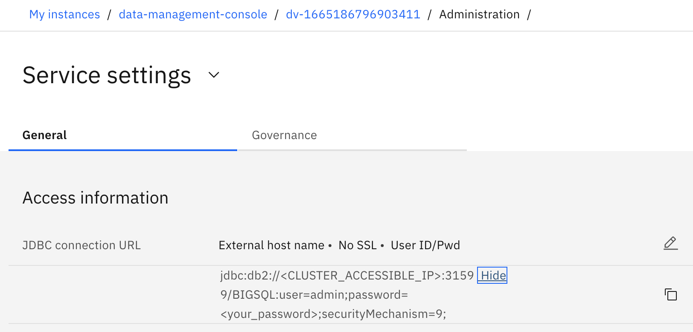

# DV Access configuration on HAProxy



```bash
sudo vi /etc/haproxy/haproxy.cfg
```

Add the following lines at the end

```bash
frontend dv-db2
    bind *:31599
    default_backend dv-db2
    option tcplog

backend dv-db2
    balance source
    server worker1-http-router0 10.3.67.21:31599 check
    server worker2-http-router1 10.3.67.22:31599 check
    server worker3-http-router2 10.3.67.23:31599 check
    server worker4-http-router3 10.3.67.24:31599 check
    server worker5-http-router4 10.3.67.25:31599 check
```

Restart and check HAProxy

```bash
$ sudo systemctl restart haproxy

$ sudo systemctl status haproxy
● haproxy.service - HAProxy Load Balancer
   Loaded: loaded (/usr/lib/systemd/system/haproxy.service; enabled; vendor preset: disabled)
  Drop-In: /etc/systemd/system/haproxy.service.d
           └─restart.conf
   Active: active (running) since Mon 2023-01-16 03:36:07 EST; 5s ago
  Process: 2310709 ExecStartPre=/usr/sbin/haproxy -f $CONFIG -f $CFGDIR -c -q $OPTIONS (code=exited, status=0/SUCCESS)
 Main PID: 2310712 (haproxy)
    Tasks: 2 (limit: 75278)
   Memory: 10.3M
   CGroup: /system.slice/haproxy.service
           ├─2310712 /usr/sbin/haproxy -Ws -f /etc/haproxy/haproxy.cfg -f /etc/haproxy/conf.d -p /run/haproxy.pid
           └─2310716 /usr/sbin/haproxy -Ws -f /etc/haproxy/haproxy.cfg -f /etc/haproxy/conf.d -p /run/haproxy.pid

Jan 16 03:36:07 bastion.cp4d.techsales.mop.ibm haproxy[2310712]: [WARNING] 015/033607 (2310712) : config : 'option forwardfor' ignored for backend 'openshift-api-server' as it requires HTTP mode.
Jan 16 03:36:07 bastion.cp4d.techsales.mop.ibm haproxy[2310712]: [WARNING] 015/033607 (2310712) : config : 'option forwardfor' ignored for frontend 'machine-config-server' as it requires HTTP mode.
Jan 16 03:36:07 bastion.cp4d.techsales.mop.ibm haproxy[2310712]: [WARNING] 015/033607 (2310712) : config : 'option forwardfor' ignored for backend 'machine-config-server' as it requires HTTP mode.
Jan 16 03:36:07 bastion.cp4d.techsales.mop.ibm haproxy[2310712]: [WARNING] 015/033607 (2310712) : config : 'option forwardfor' ignored for frontend 'ingress-http' as it requires HTTP mode.
Jan 16 03:36:07 bastion.cp4d.techsales.mop.ibm haproxy[2310712]: [WARNING] 015/033607 (2310712) : config : 'option forwardfor' ignored for backend 'ingress-http' as it requires HTTP mode.
Jan 16 03:36:07 bastion.cp4d.techsales.mop.ibm haproxy[2310712]: [WARNING] 015/033607 (2310712) : config : 'option forwardfor' ignored for frontend 'ingress-https' as it requires HTTP mode.
Jan 16 03:36:07 bastion.cp4d.techsales.mop.ibm haproxy[2310712]: [WARNING] 015/033607 (2310712) : config : 'option forwardfor' ignored for backend 'ingress-https' as it requires HTTP mode.
Jan 16 03:36:07 bastion.cp4d.techsales.mop.ibm haproxy[2310712]: [WARNING] 015/033607 (2310712) : config : 'option forwardfor' ignored for frontend 'dv-db2' as it requires HTTP mode.
Jan 16 03:36:07 bastion.cp4d.techsales.mop.ibm haproxy[2310712]: [WARNING] 015/033607 (2310712) : config : 'option forwardfor' ignored for backend 'dv-db2' as it requires HTTP mode.
Jan 16 03:36:07 bastion.cp4d.techsales.mop.ibm systemd[1]: Started HAProxy Load Balancer.
```

Open Firewall

```bash
sudo firewall-cmd --list-ports
sudo firewall-cmd --add-port=31599/tcp --permanent
sudo firewall-cmd --reload
sudo firewall-cmd --list-ports
```

Test connexion

```bash
$ nc -zv cpd-cpd452.apps.cp4d.techsales.mop.ibm 31599
Ncat: Version 7.70 ( https://nmap.org/ncat )
Ncat: Connected to 10.3.67.1:3159.
Ncat: 0 bytes sent, 0 bytes received in 0.01 seconds.
```

## DBeaver configuration


Don’t set up the `securityMechanism` parameter as it didn’t work for me. With just this configuration it works.

## Check Db2 configuration

```bash
db2set -all
```

Check DB2COMM includes `TCPIP`