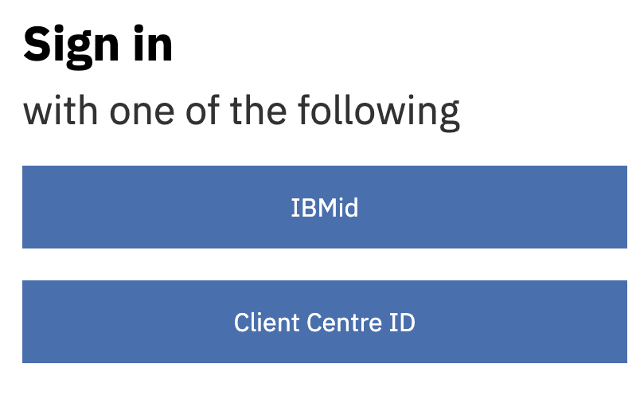
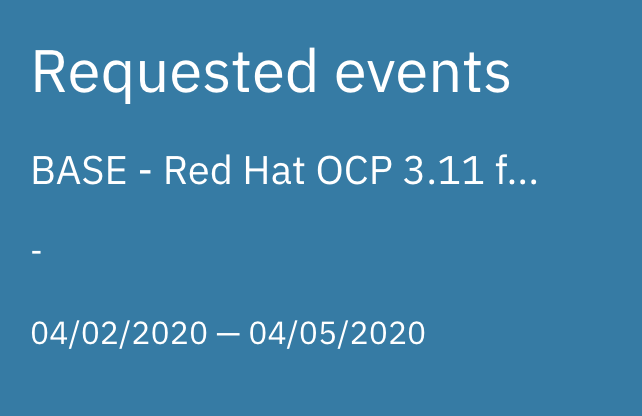
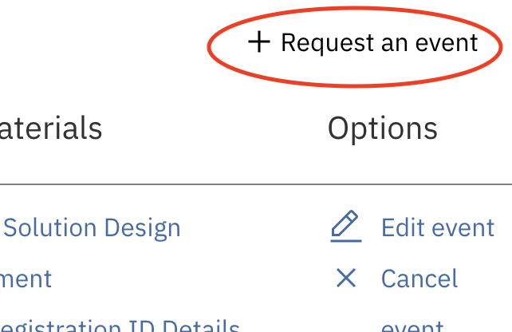
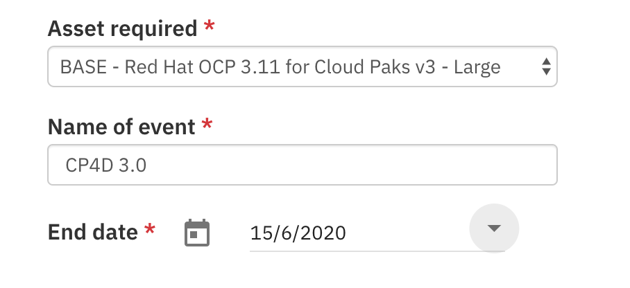
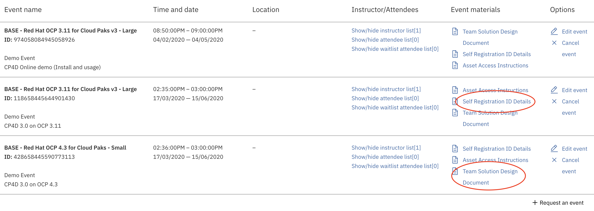
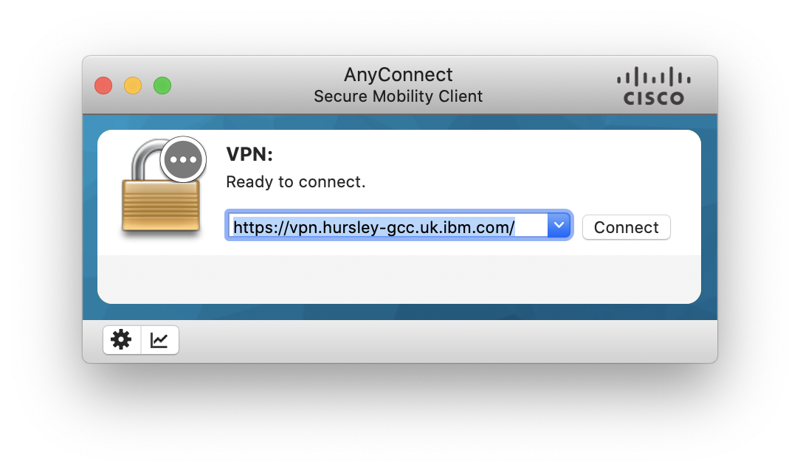
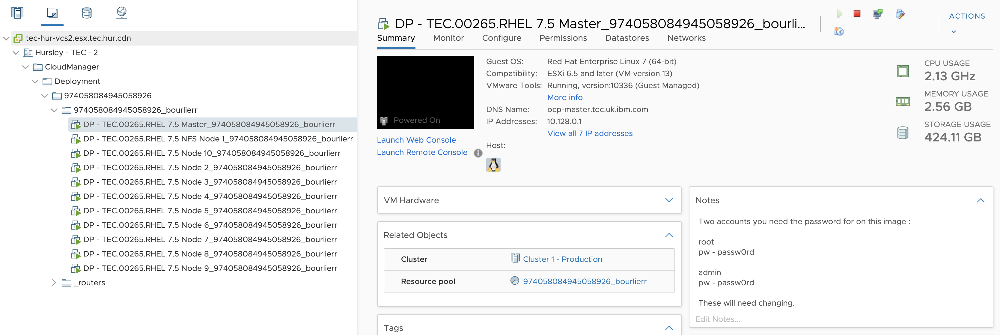

# Setting up your TEC envinronment

TEC allows you to get a test envinronment for up to 90 days. This is pleny enough to test and use CP4D. If you need an environment for a longer period, try to get one in FYRE. I asked for one many month ago and I am still waiting :(

## TEC request

TEC is available at [https://iccve.uk.ibm.com](https://iccve.uk.ibm.com/)

Login with your IBMid

{: width='200px' border='2'}

Once authenticated, click on "Requested Events" and then on "+ Request and event"

{: width='300px' border='2'}
{: width='200px' border='2'}

Select Demo

Choose "BASE - Red Hat OCP 3.11 for Cloud Paks v3 - Large"
Enter a name for your environment "CP4D 3.0" in my example
Select the end date, a maximum of 90 days is allowed and you can extend the period. Be careful, there is no warning before closing an environment.

{: width='500px' border='2'}

You will get a bunch of email with login and password for VPN and letting you know the environment is available.

## Information

All information are located in the TEC site.

{: width='600px' border='2'}

* "Asset Access Instructions" document includes all information on how to access your clluster, includiing IP addresses.
* "Team Solution Design Document" documents includes all information on OpenShift cluster : size, accesses, ...

## VPN Access

First you need to connect to the TEC VPN.

Go to the website to change the default password sent : [https://vpn.hursley-gcc.uk.ibm.com/](https://vpn.hursley-gcc.uk.ibm.com/)

Then you can connect directly to the VPN through AnyConnect. I had some issue downloading it from the website and as IBMer we don’t need to, you can enter directly the right address : https://vpn.hursley-gcc.uk.ibm.com/
{: width='600px' border='2'}

## Connect with VNC to NFS server

NFS Server IP is the first on in the list you got from emails.

Tip on MacOS : use the client from RealVNC : [https://www.realvnc.com/en/connect/download/viewer/](https://www.realvnc.com/en/connect/download/viewer/)

## VM Management

VM Management is done with VMWare

Go to [https://tec-hur-vcs2.esx.tec.hur.cdn/](https://tec-hur-vcs2.esx.tec.hur.cdn/) and use your TEC credentials. Use the HTML version and go to the VM level.
{: width='600px' border='2'}

From there you can start and stop VM to save resources.

## SSH Connexion

SSH connexion is working from scratch, nothing to do.

Login / password is root / passw0rd

I recommend using SSH keys and changing the root password.

## OpenShift Console

You can access OpenShift Console directly from your PC.

* Update your /etc/hosts file add a line:

      `<2nd IP address> ocp-master.tec.uk.ibm.com ocp-master.tec.uk.ibm.com console.apps.tec.uk.ibm.com zen-cpd-zen.apps.tec.uk.ibm.com`
      
      Replace <2nd IP address> with the second IP adress in the list you got in one of the emails.
	
* Open a browser (from VNC or your workstation)
* https://ocp-master.tec.uk.ibm.com:8443
* Passwords:
	* admin / passw0rd
	* root / passw0rd

## Sources

Documentation from 

* [https://www.ibm.com/support/producthub/icpdata/docs/content/SSQNUZ_current/cpd/install/registry_server.html](https://www.ibm.com/support/producthub/icpdata/docs/content/SSQNUZ_current/cpd/install/registry_server.html)
* [https://www.ibm.com/support/producthub/icpdata/docs/content/SSQNUZ_current/cpd/install/rhos-install.html](https://www.ibm.com/support/producthub/icpdata/docs/content/SSQNUZ_current/cpd/install/registry_server.html)

